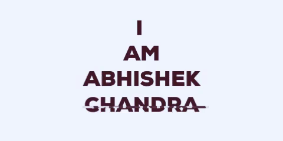

# नमस्ते ! 

<!--### I am Abhishek Chandra.  -->

### I am doing B.Tech. from Guru Gobind Singh Indraprastha University, New Delhi. 

####  🔭 I’m currently working on a Machine Learning Project. 
####  🌱 I’m currently learning Java. 
####  :bell: I’m looking to collaborate on Data Analytics Projects. 
####  :runner: I’m looking for help with Full Stack Development. 
####  :cyclone: Knowledge fact: The GitHub is written in Ruby on Rails and Erlang programming language by its cofounders. 

###### Connect with me on

 
 

 <a href = "https://github.com/abhishekchandra2522k/abhishekchandra2522k/blob/master/Top_Langs.md"> Top Language Card</a>

 

